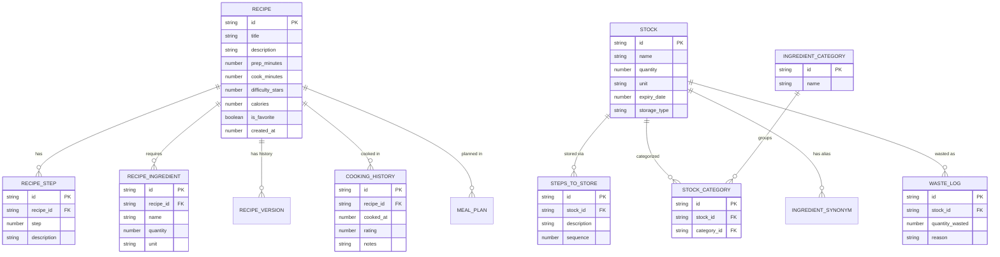

# DoneDish Database Schema

This document details the database schema architecture for DoneDish (legacy: Cookkit), an offline-first mobile cooking application.

## 1. Database Technology Choices

The application uses **WatermelonDB** as its primary local database, which is built on top of **SQLite**.

### Why WatermelonDB?

- **Offline-First Architecture**: WatermelonDB is designed specifically for React Native applications that require offline capabilities. It provides a local, persistent data store that users can rely on even without an internet connection.
- **Reactivity**: It seamlessly integrates with React's rendering lifecycle via Higher-Order Components (HOCs) and Hooks. UI components automatically update when the underlying data changes without manual re-fetching.
- **High Performance**: Unlike traditional SQLite wrappers or simple key-value stores, WatermelonDB uses lazy loading and native multithreading. It offloads all database operations to a background native thread, ensuring the React Native JS thread remains responsive at 60fps.
- **Sync Protocol**: It has a built-in sync protocol that makes it relatively straightforward to synchronize local changes with a remote backend (e.g., Supabase) when the network is available.

## 2. Core Tables and Schema

The schema is built around two primary domains: Recipes (discovery and cooking) and Pantry (inventory and meal planning).

### Recipes

- **`recipe`**: The core entity storing metadata about a recipe (title, prep/cook time, difficulty, calories, servings). It includes an `is_favorite` boolean to mark favorited recipes, replacing a separate join table to save join overhead.
- **`recipe_step` (Instructions)**: Sequential steps for preparing a recipe. Contains `step` (order) and `description`.
- **`recipe_ingredient` (Ingredients for a recipe)**: The specific components needed for a recipe, including `quantity` and `unit`.
- **`recipe_version`**: Maintains a history of changes or snapshot revisions for a recipe.

### Pantry & User Data

- **`stock` (User's Ingredients)**: Tracks the physical ingredients a user owns in their pantry/fridge, including `expiry_date`, `quantity`, and `storage_type`.
- **`cooking_history`**: Tracks user engagement with recipes. When a user finishes cooking, an entry is added with timestamps, ratings, and notes.
- **`waste_log`**: Records ingredients that were discarded (e.g., expired or spoiled) for analytics and cost tracking.

### Metadata & Reference Data

- **`ingredient_category`**: Broad categorizations for ingredients (e.g., Dairy, Produce).
- **`ingredient_synonym`**: Helps with the AI matching engine by linking alternate names to a core ingredient.
- **`steps_to_store`**: Instructions on how to properly store an ingredient to maximize shelf life.

## 3. Relationships and Indexes for Performance

In WatermelonDB, performance is heavily dictated by indexes on foreign keys. All foreign keys (`_id` columns) are indexed (`isIndexed: true`) to optimize join queries and relation fetching.

- **One-to-Many**:
  - `recipe` ⟷ `recipe_step` (via `recipe_id` on `recipe_step`)
  - `recipe` ⟷ `recipe_ingredient` (via `recipe_id` on `recipe_ingredient`)
  - `recipe` ⟷ `recipe_version` (via `recipe_id` on `recipe_version`)
  - `stock` ⟷ `steps_to_store` (via `stock_id` on `steps_to_store`)

- **Many-to-Many**:
  - `stock` ⟷ `ingredient_category` (via Pivot Table `stock_category` with `stock_id` and `category_id`)

### Indexing Strategy

- **Foreign Keys**: Every relation ID (e.g., `recipe_id`, `stock_id`) is strictly indexed. This turns potentially full-table scans into rapid O(log N) lookups.
- **Query Optimization**: When querying large datasets (like checking if multiple ingredients exist in the pantry), the app uses chunked `Q.oneOf` queries. Since SQLite limits query variables, indexing these target fields ensures bulk fetches remain performant.
- **Hash Lookups**: The `tailored_recipe_mapping` table uses an indexed `hash` column to rapidly retrieve cached recipe recommendations based on the current state of a user's pantry.

## 4. Migration Strategy for Schema Evolution

WatermelonDB handles schema evolution via a structured migration file (`data/db/migrations.ts`).

### Process

1. **Version Bump**: The `appSchema` version integer is incremented.
2. **Migration Steps**: Within `migrations.ts`, a new migration block is defined for the target version.
3. **Operations**:
   - `createTable({ name, columns })`: Added when introducing a completely new feature (e.g., adding `cooking_history`).
   - `addColumns({ table, columns })`: Used to append new attributes to an existing model without destroying data (e.g., adding an `is_favorite` boolean to `recipe`).
4. **Deployment**: When the app boots on a user's device, WatermelonDB detects the version mismatch between the SQLite file and the JS definition, and sequentially applies the necessary migration steps to bring the local DB up to date.

_Note: WatermelonDB migrations do not currently support renaming or deleting columns easily. Deprecated columns are typically left in the database but ignored in the application logic to prevent data loss._

## 5. Entity-Relationship Diagram (ERD)

Below is the Mermaid ERD illustrating the relationships between the core tables.

