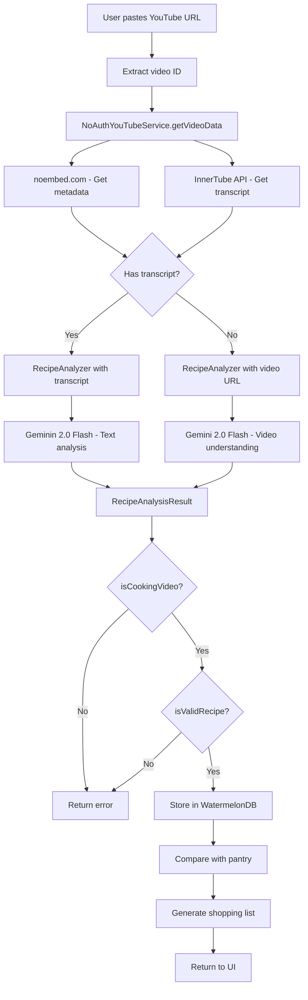
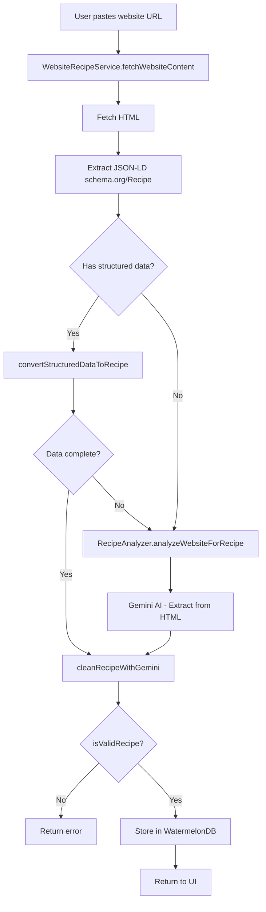
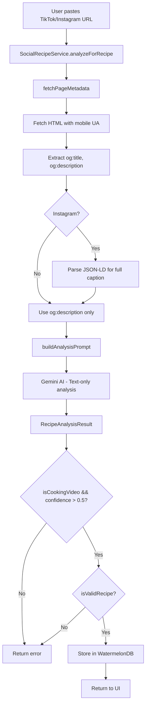

# Recipe Import/Scraping Architecture

> **Purpose**: Document the recipe import system that extracts recipes from multiple sources (YouTube, TikTok, Instagram, websites) using Gemini AI analysis.

---

## 📋 Overview

The recipe import system enables users to add recipes to DoneDish by pasting URLs from various sources. The system automatically fetches content, extracts recipe data using multiple strategies, and validates the results before storing in WatermelonDB.

### Supported Sources

| Source        | Service                                   | Data Extraction                                     |
| ------------- | ----------------------------------------- | --------------------------------------------------- |
| **YouTube**   | `NoAuthYouTubeService` + `RecipeAnalyzer` | noembed metadata + InnerTube transcript + Gemini AI |
| **TikTok**    | `SocialRecipeService`                     | Page metadata + Gemini AI text analysis             |
| **Instagram** | `SocialRecipeService`                     | Page metadata + JSON-LD + Gemini AI text analysis   |
| **Websites**  | `WebsiteRecipeService`                    | JSON-LD structured data + Gemini AI cleaning        |

### Key Features

- **Multi-source support**: Unified API for importing from different platforms
- **Fallback strategies**: Gracefully handles missing data (e.g., no transcript)
- **AI-powered extraction**: Gemini 2.0 Flash for intelligent recipe parsing
- **Validation pipeline**: Ensures data quality before storage
- **Pantry comparison**: Automatic shopping list generation

---

## 🏗️ System Architecture

### High-Level Flow

```
┌─────────────────┐     ┌──────────────────┐     ┌─────────────────┐     ┌─────────────────┐
│  User provides  │ ──▶ │  URL Router      │ ──▶ │  Source Service │ ──▶ │  Fetch Content  │
│  URL            │     │  (platform detect)│     │  (platform spec)│     │  (metadata +    │
└─────────────────┘     └──────────────────┘     └─────────────────┘     │  HTML/transcript)│
                                                                       └─────────────────┘
                                                                                 │
                                                                                 ▼
┌─────────────────┐     ┌──────────────────┐     ┌─────────────────┐     ┌─────────────────┐
│  Generate       │ ◀── │  Validate Recipe │ ◀── │  Parse/Extract  │ ◀── │  Gemini AI      │
│  Shopping List  │     │  (isValidRecipe) │     │  (structured/   │     │  Analysis       │
│  (pantry comp)  │     │                  │     │   AI-generated) │     │  (recipe schema)│
└─────────────────┘     └──────────────────┘     └─────────────────┘     └─────────────────┘
```

### Service Layer Architecture

```
lib/recipe-scrapper/
├── SocialRecipeService.ts       # TikTok/Instagram importer
│   ├── analyzeForRecipe()       # Main entry point
│   ├── fetchPageMetadata()      # Extract og:title, og:description
│   └── buildAnalysisPrompt()    # AI prompt engineering
│
├── WebsiteRecipeService.ts      # Website recipe importer
│   ├── fetchWebsiteContent()    # Fetch HTML + extract JSON-LD
│   ├── convertStructuredDataToRecipe()  # Parse schema.org/Recipe
│   └── cleanRecipeWithGemini()  # Normalize ingredient names, units
│
├── validation-utils.ts          # Shared validation logic
│   └── isValidRecipe()          # Check title, ingredients, steps
│
└── youtube/
    ├── types.ts                 # IYouTubeService interface
    ├── YouTubeServiceFactory.ts # Factory pattern
    ├── NoAuthYouTubeService.ts  # noembed + InnerTube API (MVP)
    ├── AuthYouTubeService.ts    # YouTube Data API v3 (future)
    └── RecipeAnalyzer.ts        # Gemini AI for video/content analysis
```

---

## 📝 Component Descriptions

### 1. URL Router (Platform Detection)

The system first identifies the source platform from the URL:

```typescript
// Typical implementation (not shown in code)
function detectPlatform(url: string): "youtube" | "tiktok" | "instagram" | "website" | null {
  if (url.includes("youtube.com") || url.includes("youtu.be")) return "youtube";
  if (url.includes("tiktok.com")) return "tiktok";
  if (url.includes("instagram.com")) return "instagram";
  if (url.startsWith("http")) return "website";
  return null;
}
```

### 2. SocialRecipeService

**Purpose**: Extract recipes from TikTok and Instagram posts.

**File**: `lib/recipe-scrapper/SocialRecipeService.ts`

**Strategy**:

1. Fetch page HTML with mobile User-Agent
2. Extract Open Graph metadata (og:title, og:description)
3. For Instagram: Parse JSON-LD for full caption
4. Send metadata to Gemini for recipe extraction
5. Validate results before returning

**Key Methods**:

- `analyzeForRecipe(content: SocialMediaContent)` - Main entry point
- `fetchPageMetadata(url: string)` - Extract HTML metadata
- `buildAnalysisPrompt(content, metadata)` - Construct AI prompt

**Limitations**:

- Cannot directly analyze video (social URLs aren't direct video files)
- Relies on text description being present in caption
- Lower confidence when description is sparse

### 3. WebsiteRecipeService

**Purpose**: Extract recipes from websites using structured data and AI.

**File**: `lib/recipe-scrapper/WebsiteRecipeService.ts`

**Strategy**:

1. Fetch website HTML
2. Extract JSON-LD `schema.org/Recipe` data if present
3. Fall back to AI analysis if structured data is incomplete
4. Clean and normalize results with Gemini

**Key Methods**:

- `fetchWebsiteContent(url: string)` - Fetch HTML + structured data
- `convertStructuredDataToRecipe(data, url)` - Parse schema.org/Recipe
- `cleanRecipeWithGemini(recipe)` - Normalize ingredients, steps

**Structured Data Handling**:

```typescript
interface StructuredRecipeData {
  name: string;
  description?: string;
  image?: string | string[];
  prepTime?: string; // ISO 8601 duration
  cookTime?: string;
  recipeYield?: string;
  recipeIngredient?: string[];
  recipeInstructions?: RecipeInstruction[] | string[] | string;
  nutrition?: { calories?: string };
  recipeCategory?: string | string[];
  recipeCuisine?: string | string[];
}
```

**Cleaning Process**:

1. Normalize ingredient names to singular form
2. Standardize units (cup, tablespoon, teaspoon, gram)
3. Create actionable step titles
4. Add relevant tags (cuisine, meal type, dietary)
5. Remove emotional words from titles ("Delicious", "Best Ever")

### 4. YouTube Services

#### 4.1 Service Abstraction (Factory Pattern)

**File**: `lib/recipe-scrapper/youtube/YouTubeServiceFactory.ts`

```typescript
export interface IYouTubeService {
  getVideoInfo(videoId: string): Promise<YouTubeVideoInfo>;
  getTranscript(videoId: string): Promise<YouTubeTranscript>;
  getVideoData(videoId: string): Promise<YouTubeDataResult>;
  hasFullMetadata(): boolean;
}
```

**Factory Function**:

```typescript
export function createYouTubeService(type: YouTubeServiceType = "noauth"): IYouTubeService {
  switch (type) {
    case "noauth":
      return new NoAuthYouTubeService();
    case "auth":
      throw new Error("AuthYouTubeService not yet implemented");
  }
}
```

#### 4.2 NoAuthYouTubeService (MVP)

**File**: `lib/recipe-scrapper/youtube/NoAuthYouTubeService.ts`

**Metadata Fetching**: Uses noembed.com for basic video info

- Title
- Channel name
- Thumbnail URL
- ❌ Description (not available via noembed)
- ❌ Duration (not available via noembed)

**Transcript Fetching**: Multiple fallback strategies:

| Strategy           | Method                        | Reliability   |
| ------------------ | ----------------------------- | ------------- |
| InnerTube API      | YouTube's Android client API  | ⭐⭐⭐⭐ Best |
| youtube-transcript | npm package                   | ⭐⭐⭐ Good   |
| Proxy API          | lemnoslife.com public API     | ⭐⭐ Fair     |
| Direct scraping    | Parse ytInitialPlayerResponse | ⭐⭐ Fallback |

**InnerTube API Flow**:

```typescript
POST https://www.youtube.com/youtubei/v1/player
Headers:
  X-YouTube-Client-Name: 3 (ANDROID)
  X-YouTube-Client-Version: 19.09.37
Body:
  { context: { client: { clientName: "ANDROID", ... } }, videoId }

Response:
  captions.playerCaptionsTracklistRenderer.captionTracks[]
    → baseUrl (fetch caption XML/JSON)
```

#### 4.3 RecipeAnalyzer (AI Analysis)

**File**: `lib/recipe-scrapper/youtube/RecipeAnalyzer.ts`

**Three Analysis Modes**:

1. **Transcript-based** (when available):
   - Sends transcript text + metadata to Gemini
   - Higher accuracy for ingredient quantities

2. **Video-based** (when no transcript):
   - Uses Gemini's native YouTube video understanding
   - Sends video URL directly for AI to "watch"

3. **Website-based** (for website content):
   - Analyzes HTML content + structured data
   - Fills gaps from incomplete schema.org data

**Recipe Schema**:

```typescript
{
  isCookingVideo: boolean;      // Is this cooking content?
  confidence: number;           // 0-1 score
  errorMessage?: string;
  recipe?: {
    title: string;
    description: string;
    prepMinutes: number;
    cookMinutes: number;
    servings: number;
    difficultyStars: number;    // 1-5
    calories?: number;
    tags: string[];
    ingredients: Array<{
      name: string;
      quantity: number;
      unit: string;
      notes?: string;
    }>;
    steps: Array<{
      step: number;
      title: string;
      description: string;
    }>;
  };
}
```

### 5. Validation Utilities

**File**: `lib/recipe-scrapper/validation-utils.ts`

```typescript
export function isValidRecipe(recipe: Partial<GeneratedRecipe>): boolean {
  // 1. Check title exists and non-empty
  // 2. Check has valid ingredients (excludes "Unknown ingredient")
  // 3. Check has valid steps with descriptions
  // 4. Check servings is positive
  return true / false;
}
```

---

## 📊 Data Flow Diagrams

### YouTube Import Flow



### Website Import Flow



### Social Media Import Flow



---

## 🗂️ File Structure

```
lib/
├── recipe-scrapper/
│   ├── SocialRecipeService.ts          # TikTok/Instagram importer
│   ├── WebsiteRecipeService.ts         # Website recipe importer
│   ├── validation-utils.ts             # Recipe validation
│   └── youtube/
│       ├── types.ts                    # Service interfaces
│       ├── YouTubeServiceFactory.ts    # Factory pattern
│       ├── NoAuthYouTubeService.ts     # MVP implementation
│       ├── AuthYouTubeService.ts       # Future (YouTube Data API)
│       ├── RecipeAnalyzer.ts           # Gemini AI analysis
│       └── index.ts                    # Barrel export
│
types/
└── ScrappedRecipe.ts                   # Shared type definitions

utils/
└── gemini-api.ts                       # Gemini API wrapper
```

---

## 📋 Type Definitions

### Core Types

```typescript
// Result from AI analysis
export interface RecipeAnalysisResult {
  isCookingVideo: boolean;
  confidence: number; // 0-1
  recipe?: GeneratedRecipe;
  errorMessage?: string;
}

// Generated recipe format
export interface GeneratedRecipe {
  title: string;
  description: string;
  prepMinutes: number;
  cookMinutes: number;
  servings: number;
  difficultyStars: number; // 1-5
  ingredients: Array<{
    name: string;
    quantity: number;
    unit: string;
    notes?: string;
  }>;
  steps: Array<{
    step: number;
    title: string;
    description: string;
  }>;
  tags: string[];
  sourceUrl: string;
  calories?: number;
}
```

---

## 🔧 Error Handling

### YouTube-Specific Errors

```typescript
export class YouTubeServiceError extends Error {
  constructor(
    message: string,
    public readonly code:
      | "VIDEO_NOT_FOUND" // Video doesn't exist or is private
      | "NO_CAPTIONS" // No transcript available
      | "NETWORK_ERROR" // Fetch failed
      | "RATE_LIMITED" // Too many requests
      | "API_ERROR" // YouTube API error
      | "PARSE_ERROR" // Failed to parse response
  ) {
    super(message);
    this.name = "YouTubeServiceError";
  }
}
```

### Fallback Strategy

```
┌─────────────────────────────────────────────────────────────┐
│                    TRANSCRIPT FETCH                          │
├─────────────────────────────────────────────────────────────┤
│ 1. InnerTube API (primary)                                  │
│    ↓ fails                                                  │
│ 2. youtube-transcript package                               │
│    ↓ fails                                                  │
│ 3. Direct page scraping                                     │
│    ↓ fails                                                  │
│ 4. Proceed without transcript (use video URL for Gemini)    │
└─────────────────────────────────────────────────────────────┘
```

---

## 🛡️ Validation Rules

### Recipe Content Validation

| Field           | Validation Rule                                          |
| --------------- | -------------------------------------------------------- |
| **Title**       | Must be non-empty string                                 |
| **Ingredients** | Must have ≥1 valid ingredient (not "Unknown ingredient") |
| **Steps**       | Must have ≥1 step with non-empty description             |
| **Servings**    | Must be positive number                                  |

### Post-AI Validation

```typescript
// Applied to all AI-generated recipes
if (!isValidRecipe(recipe)) {
  return {
    isCookingVideo: true,
    confidence: 0, // Force error to user
    errorMessage: "Could not extract valid recipe",
  };
}
```

---

## 🔐 API Keys Required

| API         | Environment Variable         | Purpose                                                |
| ----------- | ---------------------------- | ------------------------------------------------------ |
| **Gemini**  | `EXPO_PUBLIC_GEMINI_API_KEY` | Recipe analysis from video/text                        |
| **YouTube** | (None - MVP uses noembed)    | Video metadata (future: `EXPO_PUBLIC_YOUTUBE_API_KEY`) |

---

## 📱 Integration Points

### UI Components

1. **Import Modal/Screen**
   - URL input field
   - Platform detection indicator
   - Progress status (validating → fetching → analyzing → saving)

2. **Recipe Preview**
   - Show extracted recipe before saving
   - Allow editing ingredients/steps
   - Confidence indicator

3. **Shopping List**
   - Missing ingredients
   - Available ingredients (with stock comparison)
   - Add to pantry button

---

## 🧪 Testing Considerations

### Unit Tests Needed

- [ ] URL parsing and platform detection
- [ ] `isValidRecipe` validation logic
- [ ] ISO 8601 duration parsing
- [ ] Ingredient quantity parsing (fractions, ranges)

### Integration Tests Needed

- [ ] Full YouTube import flow (mock transcript)
- [ ] Website import with JSON-LD
- [ ] Website import without JSON-LD (AI fallback)
- [ ] Social media import with sparse description

---

## 📚 Related Documentation

- [AI_PROMPT_ENGINEERING.md](./AI_PROMPT_ENGINEERING.md) - Detailed prompt templates
- [VALIDATION_AND_ERROR_HANDLING.md](./VALIDATION_AND_ERROR_HANDLING.md) - Validation rules

---

_Created: February 2026_
_Last Updated: February 2026_
